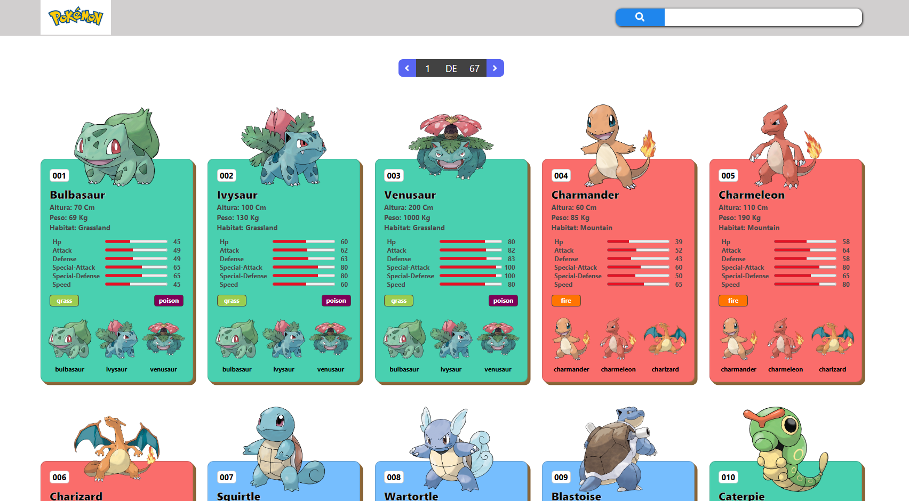

# 🔴 Pokédex - React App

¡Bienvenido a mi proyecto de Pokédex! Una aplicación web moderna para consultar información sobre Pokémon, construida con las últimas tecnologías de desarrollo web.

## 🚀 Tecnologías Usadas


> Librerías adicionales: **Axios** para peticiones API y **React Icons** para la interfaz.
 
## 📸 Capturas de Pantalla

 
🚧 **Proyecto en construcción** 🚧

## ⚙️ Instalación y Uso

Si quieres probar este proyecto en tu computadora:

1. **Clona el repositorio:**
   ```basha
   git clone [https://github.com/Axel-recq/Pokedex.git](https://github.com/Axel-recq/Pokedex.git)